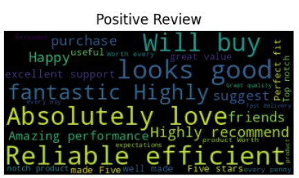
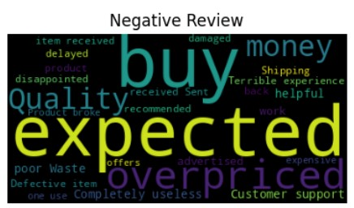

# Sentiment Analysis with TensorFlow & LSTM

This project is a **Deep Learning-based Natural Language Processing (NLP)** application that performs **Sentiment Analysis** on product reviews using a **Bidirectional LSTM model** built with TensorFlow and Keras.

---

## Project Overview

- Cleaned and visualized product review data.
- Generated WordClouds for positive and negative sentiment.
- Tokenized and padded text sequences.
- Built and trained a Bidirectional LSTM model.
- Evaluated the model using training/validation accuracy.
- Created a simple prediction function to test custom reviews.

---

## Technologies Used

- **Python**
- **TensorFlow / Keras**
- **Pandas, NumPy**
- **Matplotlib, Seaborn**
- **WordCloud**

---

##  Dataset

A CSV file `realistic_reviews.csv` containing:
- `review`: Text of the customer review.
- `sentiment`: Label (1 for Positive, 0 for Negative)

---

##  How It Works

1. **Preprocessing**  
   - Tokenization of text using Keras `Tokenizer`
   - Padding/truncating sequences for uniform length

2. **Model Architecture**
   ```python
   tf.keras.Sequential([
       tf.keras.layers.Embedding(vocab_size, 16, input_length=50),
       tf.keras.layers.Bidirectional(tf.keras.layers.LSTM(32)),
       tf.keras.layers.Dense(16, activation='relu'),
       tf.keras.layers.Dense(1, activation='sigmoid')
   ])
   ```

3. **Training**
   - Binary classification with `'binary_crossentropy'` loss
   - Trained for 10 epochs
   - Achieved high validation accuracy

4. **Prediction**
   You can input any custom review to get a sentiment prediction:
   ```python
   predict_sentiment("I love this product")   # ➡️ Positive Review
   predict_sentiment("coffee is bad")         # ➡️ Negative Review
   ```

---

## Training History Visualization

The training and validation accuracy are plotted to show model performance across epochs.

---

## Output Example (WordClouds)

  


---

## 📁 Project Structure

```
📦Sentiment-Analysis-TensorFlow-LSTM
 ┣ 📄 realistic_reviews.csv
 ┣ 📄 sentiment_model.py / notebook
 ┣ 📄 README.md
 ┗ 📊 output_visuals/
```

---

## Future Improvements
- Deploy the model using Flask or Streamlit for real-time predictions

---

##  Author

**[Pratik_Bhuwad]**  
📧 [pratikbhuwad192k4@gmail.com]  
🔗 [www.linkedin.com/in/pratik-bhuwad-a62576293]
